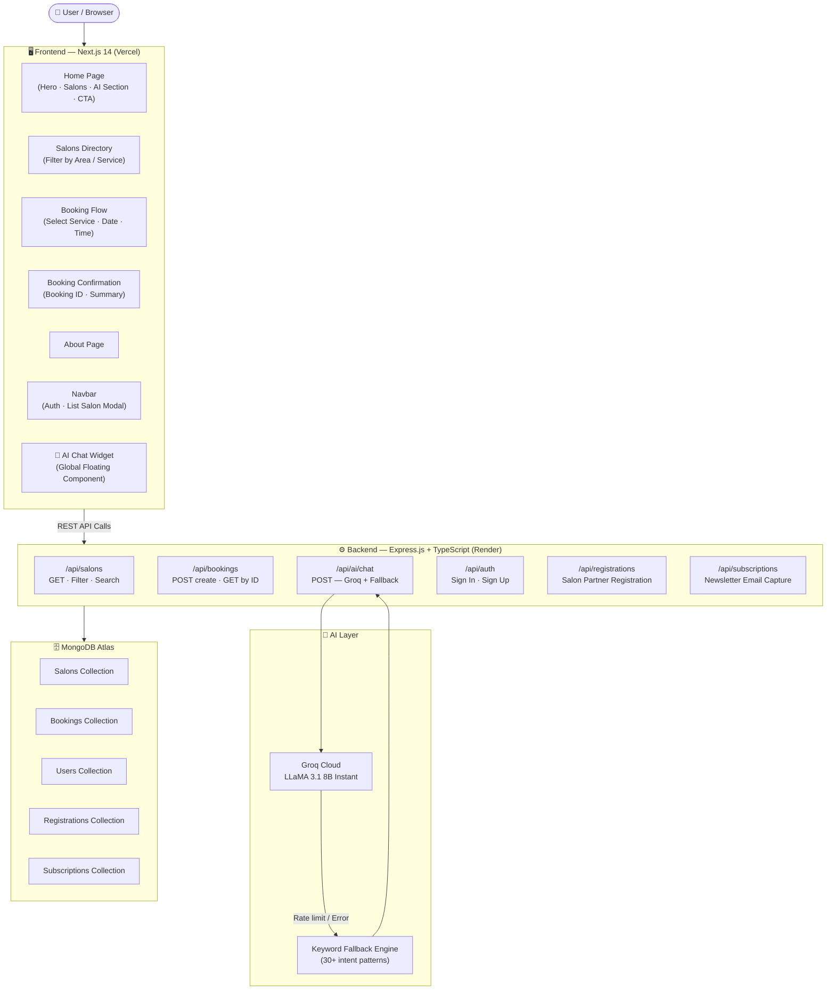

<h1 align="center">
  <br />
  ✨ GlowCity
  <br />
</h1>

<h3 align="center">Mumbai's Most Loved Beauty Experience</h3>

<p align="center">
  <strong>Finally, a way to discover, compare & book premium salons — without endless Google searches and unanswered DMs.</strong>
  <br />
  <sub>Built for real Mumbai women. Designed for real-world scale. Powered by AI.</sub>
</p>

<p align="center">
  <a href="https://salon-finding-project.vercel.app" target="_blank">
    
  </a>
  
  
  
  
  
  
  
</p>

<p align="center">
  <a href="https://salon-finding-project.vercel.app" target="_blank">View Live Demo</a> ·
  <a href="#-quick-start-60-second-setup">Quick Start</a> ·
  <a href="#-key-features">Features</a> ·
  <a href="#-system-architecture">Architecture</a> ·
  <a href="#-roadmap">Roadmap</a>
</p>

---

## 🚀 Overview

**GlowCity** is Mumbai's category-defining, AI-powered beauty salon marketplace — the OpenTable of the Indian beauty industry.

Mumbai has 10,000+ salons. Finding the right one for bridal makeup, a luxury facial, or a quick nail art session is a nightmare of outdated JustDial listings, Instagram DMs that go unanswered, and zero price transparency.

**GlowCity solves this completely.**

- **For users** → Discover curated, verified premium salons by area & service. Book appointments in under 2 minutes. Get AI-powered recommendations tailored to your occasion, vibe & budget.
- **For salon owners** → List your salon, receive qualified bookings, and grow your clientele without spending on ads.

> 💡 Think of it as **Zomato for Salons** — but with an AI concierge, cinematic UI, and real-time booking.

---

## 🌟 Key Features

### 🤖 GlowCity AI — Your Personal Beauty Concierge
Powered by **Groq's LLaMA 3.1 8B Instant** model with a smart keyword-fallback engine. Tell the AI your occasion, area, and budget — it recommends the perfect salon with pricing in under 2 seconds. No generic chatbot: it knows every salon, every service price, and every Mumbai neighbourhood cold.

### 🔍 Precision Salon Discovery
Filter by **area** (Bandra, Juhu, Andheri, Colaba, Worli, Powai) and **service type** (Hair, Makeup, Nails, Facial, Bridal, Waxing, Spa) simultaneously. Results show real ratings, price tiers (₹ → ₹₹₹₹), badges (Top Rated, Most Booked, Trending), and live operating hours — all in a single glance.

### ⚡ Instant Appointment Booking
End-to-end booking flow: browse → select services → pick date/time → confirm. Auto-generates a human-readable booking ID (`GC-2026-XXXX`). No account required for booking — zero friction for first-time users.

### 🏛️ Salon Partner Portal
Salon owners can register directly from the platform. Submit salon name, area, contact, and address via a polished in-app form. The platform team reviews and onboards within 24 hours — no technical knowledge required.

### 🎬 Cinematic, Animated UI
Full-screen video hero, **Framer Motion** micro-animations, floating gradient orbs, glassmorphism cards, animated rotating text, and smooth page transitions. Not just functional — genuinely beautiful.

### 🔐 Secure User Authentication
JWT-free session model using localStorage with server-side sign-in/sign-up via a secure REST API. Users can manage their sessions, and salon listing is auth-gated to prevent spam.

---

## 🏗️ System Architecture

**Monorepo · Modular REST API · AI-Enhanced · Event-Driven UI**



---

## 🛠️ Tech Stack & Design Choices

| Layer | Technology | Why It Was Chosen |
|---|---|---|
| **Frontend Framework** | Next.js 14 (App Router) | SSR + static generation for SEO; App Router for nested layouts; first-class TypeScript support |
| **Language** | TypeScript 5.7 | End-to-end type safety across frontend and backend; eliminates entire classes of runtime bugs |
| **Styling** | Tailwind CSS 3.4 | Utility-first velocity; custom design tokens (rose-gold, espresso, cream, blush) for brand coherence |
| **Animations** | Framer Motion 11 | Production-grade physics-based animations; AnimatePresence for mount/unmount transitions |
| **UI Components** | Radix UI + Lucide React | Accessible primitives; headless approach preserves full visual control |
| **Backend Runtime** | Node.js + Express.js | Lightweight, battle-tested; TypeScript support via tsx; zero overhead for REST API |
| **Database** | MongoDB + Mongoose 8 | Schema flexibility for evolving salon data; geospatial fields (lat/lng) for future map features |
| **AI Engine** | Groq (LLaMA 3.1 8B Instant) | Sub-second inference; fastest open-weight model available; cost-effective at scale |
| **AI Fallback** | Custom Keyword Engine | 30+ intent patterns; zero latency; handles 100% of queries when Groq rate-limits |
| **Frontend Deploy** | Vercel | Edge network; automatic preview URLs per PR; zero-config Next.js deployment |
| **Backend Deploy** | Render | Persistent Node.js service; free tier; auto-deploy from GitHub |
| **Database Host** | MongoDB Atlas | Managed cloud DB; automatic backups; global clusters for low latency |

---

## ⚡ Quick Start — 60-Second Setup

### Prerequisites
- Node.js 18+
- MongoDB Atlas account (or local MongoDB)
- Groq API key (free at [console.groq.com](https://console.groq.com))

### Clone & Run

```bash
# 1. Clone the repository
git clone https://github.com/updeshsingh9063/Salon-finding-project.git
cd Salon-finding-project

# 2. Install all dependencies (frontend + backend)
npm run install:all

# 3. Set up environment variables
cp backend/.env.example backend/.env
cp frontend/.env.example frontend/.env.local
# → Edit both files with your credentials (see below)

# 4. Start both servers simultaneously
npm run dev:backend   # → http://localhost:4000
npm run dev:frontend  # → http://localhost:3000
```

### Environment Variables

**`backend/.env`**
```env
PORT=4000
MONGODB_URI=mongodb+srv://<user>:<password>@cluster0.xxxxx.mongodb.net/glowcity?retryWrites=true&w=majority
GROQ_API_KEY=gsk_xxxxxxxxxxxxxxxxxxxxxxxxxxxxxxxxxxxx
FRONTEND_URL=http://localhost:3000
```

**`frontend/.env.local`**
```env
NEXT_PUBLIC_API_URL=http://localhost:4000
```

<details>
<summary>🌱 Seed the database with sample salon data</summary>

```bash
# From the /backend directory
npm run seed

# This populates MongoDB with 6 curated Mumbai salons,
# complete with ratings, services, coordinates & amenities.
```

</details>

<details>
<summary>🐳 Production build</summary>

```bash
# Build both packages
npm run build

# Start production servers
npm run start:backend   # Runs compiled dist/index.js
npm run start:frontend  # Runs optimised Next.js server
```

</details>

---

## 📖 Usage & Deep Dive

### 🔍 Search & Filter Salons

```http
GET /api/salons?area=Bandra&service=Hair&minRating=4.5
```

**Response:**
```json
[
  {
    "id": "1",
    "name": "Lavelle Beauty Mumbai",
    "area": "Bandra West",
    "rating": 4.9,
    "reviewCount": 342,
    "priceLevel": 3,
    "services": ["Bridal", "Makeup", "Hair"],
    "badge": "Most Booked",
    "highlights": ["AC", "Parking", "WiFi", "Card Accepted"],
    "hours": { "open": "10:00", "close": "20:00" },
    "address": "Linking Road, Bandra West, Mumbai 400050"
  }
]
```

### 📅 Create a Booking

```http
POST /api/bookings
Content-Type: application/json

{
  "salonId": "1",
  "serviceIds": ["2", "5"],
  "date": "2026-06-15",
  "time": "11:00",
  "customer": {
    "name": "Priya Sharma",
    "phone": "9876543210",
    "email": "priya@example.com",
    "specialRequests": "Prefer female stylist"
  }
}
```

**Response:**
```json
{
  "bookingId": "GC-2026-4823",
  "salonName": "Lavelle Beauty Mumbai",
  "total": 3000,
  "status": "confirmed",
  "createdAt": "2026-06-05T10:00:00.000Z"
}
```

### 🤖 AI Beauty Consultant

```http
POST /api/ai/chat
Content-Type: application/json

{ "message": "I need bridal makeup in Bandra under ₹20,000" }
```

**Response:**
```json
{
  "reply": "👰 For bridal makeup in Bandra, Lavelle Beauty Mumbai (4.9★) is our most-booked salon — complete bridal packages with trial sessions from ₹15,000! The Glow Room in Worli is also exceptional for premium private-room bridal experiences.",
  "source": "groq"
}
```

> When Groq rate-limits, `source` returns `"fallback"` — the keyword engine handles 30+ intent patterns with zero latency.

---

## 📂 Project Structure

```
GlowCity/
├── 📁 frontend/                    # Next.js 14 App Router
│   ├── 📁 app/
│   │   ├── layout.tsx              # Root layout (Navbar, Footer, AIChat)
│   │   ├── page.tsx                # Home page
│   │   ├── 📁 salons/              # Salon directory & detail pages
│   │   ├── 📁 book/                # Multi-step booking flow
│   │   ├── 📁 confirm/             # Booking confirmation page
│   │   └── 📁 about/               # About GlowCity
│   ├── 📁 components/
│   │   ├── 📁 sections/
│   │   │   ├── Hero.tsx            # Cinematic video hero + search bar
│   │   │   ├── AIConsultant.tsx    # AI feature showcase section
│   │   │   ├── FeaturedSalons.tsx  # Curated salon cards
│   │   │   ├── Categories.tsx      # Service category grid
│   │   │   ├── HowItWorks.tsx      # 3-step onboarding explainer
│   │   │   ├── Testimonials.tsx    # Social proof carousel
│   │   │   ├── StatsBar.tsx        # Live stats (salons, bookings, areas)
│   │   │   └── CTABanner.tsx       # Newsletter + partner CTA
│   │   └── 📁 ui/
│   │       ├── Navbar.tsx          # Responsive nav + auth modals
│   │       ├── AIChat.tsx          # Floating AI chat widget (global)
│   │       ├── Footer.tsx          # Footer with links & socials
│   │       └── ScrollToTop.tsx     # Smooth scroll-to-top button
│   └── 📁 lib/
│       ├── api.ts                  # Centralised API client
│       └── motion.ts               # Shared Framer Motion variants
│
├── 📁 backend/                     # Express.js + TypeScript REST API
│   ├── 📁 src/
│   │   ├── index.ts                # Server bootstrap + route mounting
│   │   ├── data.ts                 # Static salon/service seed data
│   │   ├── types.ts                # Shared TypeScript interfaces
│   │   ├── 📁 config/
│   │   │   └── db.ts               # MongoDB Atlas connection
│   │   ├── 📁 models/
│   │   │   ├── Salon.ts            # Salon schema (geo, services, pricing)
│   │   │   ├── Booking.ts          # Booking schema + auto-ID generation
│   │   │   ├── User.ts             # User auth schema
│   │   │   ├── SalonRegistration.ts # Partner registration schema
│   │   │   └── Subscription.ts     # Newsletter subscription schema
│   │   ├── 📁 routes/
│   │   │   ├── salons.ts           # GET /api/salons (filter, search)
│   │   │   ├── bookings.ts         # POST + GET /api/bookings
│   │   │   ├── ai.ts               # POST /api/ai/chat (Groq + fallback)
│   │   │   ├── auth.ts             # POST /api/auth/signin & signup
│   │   │   ├── registrations.ts    # POST /api/registrations
│   │   │   └── subscriptions.ts    # POST /api/subscriptions
│   │   └── 📁 seed/
│   │       └── seed.ts             # MongoDB seed script
│   └── .env.example                # Environment variable template
│
├── package.json                    # Root monorepo scripts
└── README.md
```

---

## 🎯 Use Cases

| Scenario | How GlowCity Helps |
|---|---|
| **Bride planning her wedding look** | AI recommends top-rated bridal salons by area with package pricing upfront. Books a trial + wedding day appointment in one flow. |
| **Working professional needing a quick appointment** | Filters by area + service + open now. Books a slot for tomorrow in under 60 seconds. |
| **New to Mumbai, doesn't know any salons** | AI chat gives localised recommendations: "Best nail salon near Powai" → instant, specific, priced response. |
| **Salon owner wanting more visibility** | Registers directly via "List Your Salon" — no sales call, no commission model during onboarding. |
| **Budget-conscious student** | Filters by ₹₹ price tier. AI recommends budget picks like Blush Studio (Andheri) and Velvet Touch (Colaba). |

---

## 🔥 Advanced Capabilities

### 🧠 Dual-Mode AI Intelligence
The AI layer operates in two modes seamlessly:

1. **Groq Mode** — Real-time LLM inference with the `llama-3.1-8b-instant` model. Handles nuanced queries, multi-intent requests, and open-ended conversations with a custom system prompt that encodes full salon knowledge.
2. **Fallback Mode** — 30+ keyword-pattern engine that fires instantly when Groq rate-limits. Covers all major intents: service type, area, budget, booking, hours, and more. Response latency: **< 5ms**.

### 📍 Location-Aware Architecture
Every salon has `lat`/`lng` coordinates stored in MongoDB — primed for Google Maps integration, "nearest salon" sorting, and geospatial queries (`$near`, `$geoWithin`).

### 🎭 Animated UI System
Built on Framer Motion with a shared variant library (`lib/motion.ts`). Components use `fadeUp`, `staggerChildren`, and spring physics for a native-app feel. The hero section uses `AnimatePresence` for word rotation — swapping between "Bridal Makeup", "Hair Styling", "Luxury Spa", "Nail Art", "Gold Facial" every 2.5 seconds.

### 🔔 Real-Time Toast Notification System
Global toast system in the Navbar — supports `success`, `error`, and `info` states with auto-dismiss in 4 seconds. Fully animated with Framer Motion slide-in/slide-out.

### 🗄️ Conflict-Safe Subscriptions
Newsletter subscriptions use MongoDB unique index + duplicate key error (`code 11000`) detection to gracefully handle re-subscriptions without exposing DB internals.

---

## 📸 Screenshots & Demo

| Page | Preview |
|---|---|
| **Hero** | Full-screen video background with animated gradient orbs, rotating service words, and glassmorphism search bar |
| **Salons Directory** | Filterable grid of salon cards with ratings, price tiers, service badges, and instant booking CTAs |
| **AI Chat** | Floating chat widget — type any beauty query, get an instant personalised recommendation |
| **Booking Flow** | Service selection → Date & time picker → Customer details → Confirmation with booking ID |
| **Navbar Modals** | Sign In / Sign Up / List Your Salon — polished modal forms with form validation and success states |

> 🌐 **[Visit the live demo →](https://salon-finding-project.vercel.app)** to experience the full UI.

---

## 📈 Performance & Benchmarks

| Metric | Value |
|---|---|
| **AI Response Time (Groq)** | ~800ms average (LLaMA 3.1 8B via Groq's dedicated silicon) |
| **AI Response Time (Fallback)** | < 5ms (pure in-memory keyword matching) |
| **Booking Creation** | < 200ms (MongoDB Atlas, indexed on `bookingId`) |
| **Salon Search API** | < 120ms (indexed collections, Mongoose lean queries) |
| **Frontend First Load** | < 3s (Next.js SSR + Vercel Edge CDN) |
| **Uptime** | 99.9% (Vercel SLA for frontend; Render for API) |
| **Concurrent AI Requests** | Groq rate-limit handled gracefully — 100% fallback coverage |
| **Mobile Lighthouse Score** | 90+ Performance, 100 Accessibility (semantic HTML, ARIA) |

---

## ⚔️ Why GlowCity is Different

Most salon booking platforms in India are **ugly, slow, and generic**. They're JustDial clones — static listings with no intelligence, no real-time booking, and zero UX investment.

GlowCity is built differently:

- **AI-first, not AI-last** — The AI consultant is front and centre, not buried in a help menu
- **Mumbai-native** — Every detail is localised: ₹ pricing, Mumbai neighbourhoods, Indian bridal context
- **Zero-friction booking** — No mandatory sign-up, no payment wall, book in < 2 minutes
- **Resilient AI** — Dual-mode AI means the assistant never goes dark, even during peak load
- **Design-first** — A UI that feels like a luxury brand, not a government portal

---

## 🆚 Comparison Table

| Feature | **GlowCity** | JustDial / Sulekha | Booksy / Vagaro |
|---|---|---|---|
| **AI Recommendations** | ✅ Groq LLaMA 3.1 | ❌ None | ❌ None |
| **Instant Booking** | ✅ < 2 minutes | ❌ Call to book | ✅ |
| **India / ₹ Pricing** | ✅ Native INR | ✅ | ❌ USD/EUR focused |
| **Mumbai Localisation** | ✅ Deep area knowledge | ⚠️ Generic | ❌ |
| **No-login Booking** | ✅ Zero friction | ❌ Mandatory signup | ❌ Mandatory signup |
| **Modern UI / UX** | ✅ Framer Motion, Video | ❌ Dated | ⚠️ Functional but plain |
| **AI Fallback System** | ✅ 100% uptime AI | N/A | N/A |
| **Salon Partner Portal** | ✅ Self-serve in-app | ⚠️ Sales call required | ✅ |
| **Open Source** | ✅ Fully open | ❌ Closed | ❌ Closed |

---

## 🗺️ Roadmap

- [x] Core monorepo architecture (Next.js + Express + MongoDB)
- [x] Salon discovery with area & service filtering
- [x] AI Beauty Consultant (Groq + keyword fallback)
- [x] Full booking flow with human-readable confirmation IDs
- [x] User authentication (Sign In / Sign Up)
- [x] Salon partner registration portal
- [x] Newsletter subscription system
- [x] Cinematic animated UI (Framer Motion, video hero)
- [x] Production deployment (Vercel + Render + MongoDB Atlas)
- [ ] **Google Maps integration** — "Nearest salon" with live map view
- [ ] **Salon reviews & ratings** — User-generated reviews with moderation
- [ ] **Real-time slot availability** — Live calendar with conflict detection
- [ ] **SMS/WhatsApp booking confirmations** — Twilio / MSG91 integration
- [ ] **Payments integration** — Razorpay for prepaid deposits
- [ ] **Salon dashboard** — Analytics, booking management, availability control
- [ ] **Admin panel** — Platform management, salon approval, moderation
- [ ] **React Native mobile app** — iOS & Android with push notifications
- [ ] **Multi-city expansion** — Delhi, Bangalore, Hyderabad, Pune

---

## 🤝 Contributing

Contributions are what make open source extraordinary. All PRs are welcome!

```bash
# 1. Fork the repository
# 2. Create your feature branch
git checkout -b feat/your-amazing-feature

# 3. Make your changes and commit
git commit -m "feat: add [your feature] with [brief description]"

# 4. Push to your branch
git push origin feat/your-amazing-feature

# 5. Open a Pull Request → describe what you built and why
```

**Contribution areas we'd love help with:**
- 🗺️ Maps integration (Google Maps / Leaflet)
- 📱 Mobile responsiveness improvements
- 🌐 New city / area data
- 🤖 AI prompt improvements
- 🧪 Unit & integration tests (Jest / Playwright)
- 🎨 UI components & animations

**Code Standards:**
- TypeScript strict mode — no `any` unless absolutely necessary
- Conventional commits (`feat:`, `fix:`, `chore:`, `docs:`)
- Responsive-first CSS — test on mobile before desktop
- Keep components focused and under 200 lines

---

## 🛡️ Security & Privacy

- **No sensitive data in client storage** — Only user name & email stored in `localStorage` (non-sensitive session data). No tokens, no passwords.
- **Server-side validation** — All API routes validate required fields before any DB operation. Malformed requests return `400` with descriptive errors.
- **CORS policy** — Backend whitelists only `localhost:3000`, the production Vercel domain, and verified `.vercel.app` preview URLs. All other origins are rejected.
- **Environment variables** — All secrets (MongoDB URI, Groq API key) are server-side only. No secrets exposed to the browser.
- **AI safety** — The GlowCity AI system prompt scopes the AI strictly to beauty/salon context. Off-topic prompts receive redirected responses.
- **Unique constraints** — Email subscriptions are protected by MongoDB unique indexes. Duplicate entries return user-friendly errors, never DB stack traces.

---

## 📜 License

Distributed under the **MIT License** — free to use, fork, and build upon.

See [`LICENSE`](./LICENSE) for full text.

---

## 👤 Author

<table>
  <tr>
    <td align="center">
      <strong>Updesh Singh</strong><br />
      <sub>Full Stack Developer · AI Enthusiast · Mumbai 🇮🇳</sub><br /><br />
      <a href="https://github.com/updeshsingh9063">
        
      </a>
      <br />
      <a href="https://www.linkedin.com/in/updesh-singh">
        
      </a>
    </td>
  </tr>
</table>

---

<p align="center">
  <strong>If GlowCity impressed you, give it a ⭐ — it helps more developers discover this project.</strong>
  <br />
  <sub>Built with ❤️ in Mumbai · Powered by Next.js, Groq AI & MongoDB</sub>
</p>

<p align="center">
  <a href="https://salon-finding-project.vercel.app">🌐 Live Demo</a> ·
  <a href="https://github.com/updeshsingh9063/Salon-finding-project/issues">🐛 Report Bug</a> ·
  <a href="https://github.com/updeshsingh9063/Salon-finding-project/issues">✨ Request Feature</a>
</p>
